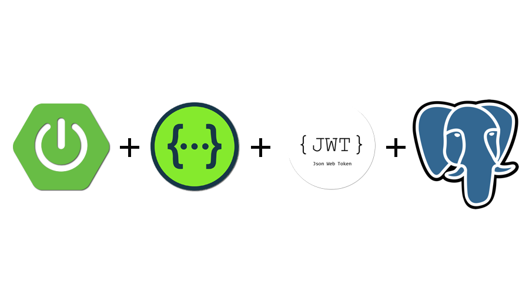

[](https://travis-ci.com/coma123/Spring-Boot-Blog-REST-API) [](https://sonarcloud.io/dashboard?id=coma123_Spring-Boot-Blog-REST-API) [](https://bestpractices.coreinfrastructure.org/projects/3706)

<p align="center">
  <a href="https://github.com/raulrobinson" target="blank"></a>
</p>

# Spring Boot, MySQL, Spring Security, JWT, JPA, Rest API

Construir Restful CRUD API para un Blog utilizando Spring Boot, Mysql, JPA e Hibernate.

## Pasos para instalar.

**1. Clonar la aplicacion.

```bash
    git clone https://github.com/raulrobinson/springboot-rest-api-rasysbox.git
```

## Requirements

- Postgres: `^14.4`
- Java: `^17`
- Maven: `^3.8.4`

## Installation

```shell
# download dependencies
$ mvn install -DskipTests

# run the application
$ mvn spring-boot:run

# run the tests
$ mvn test

# to build for production
$ mvn clean package

# to generate the coverage report after testing (available at: target/site/jacoco/index.html)
$ mvn jacoco:report
```

## Running a specific test
utilice el parametro `-Dtest=<class>#<method>`


Por ejemplo para integrar una prueba. creando un usuario:
```
$ mvn test -Dtest=UsersControllerIntegrationTests#should_save_a_new_user
```

## Swagger
Cuando la aplicacion este ejecutandose, estaran disponibles en: [localhost:8080/documentation](localhost:8080/documentation)

